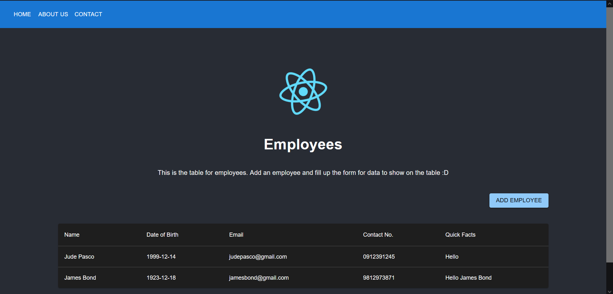
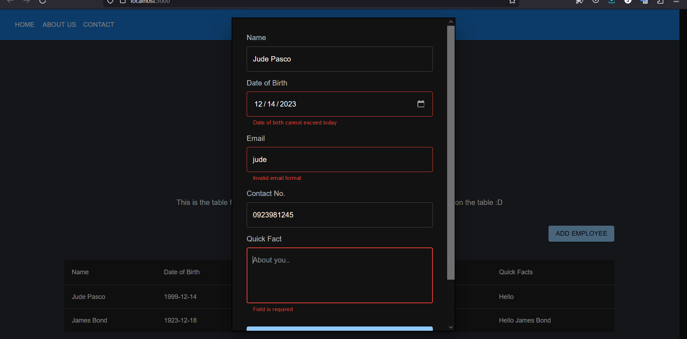
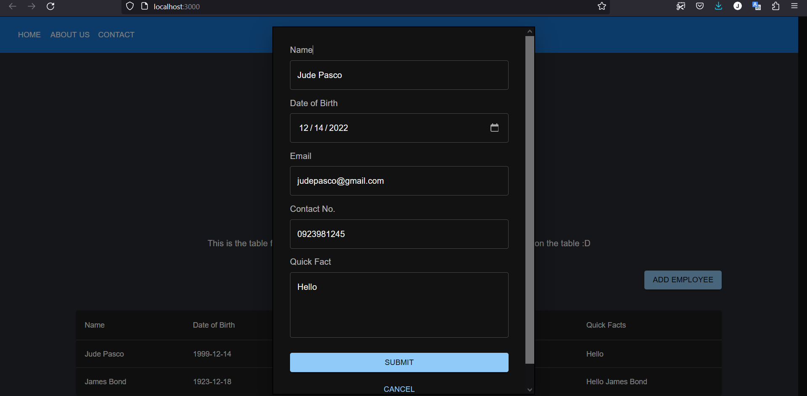
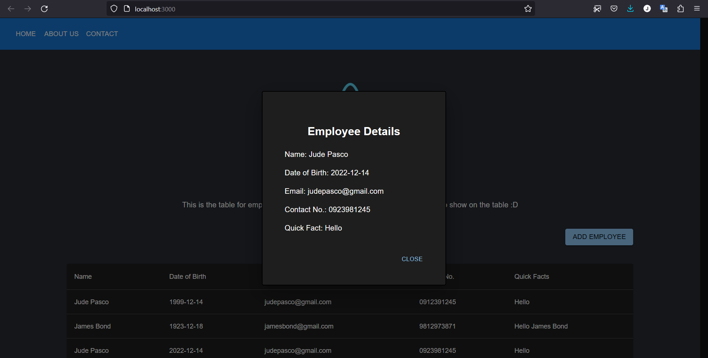

# React Assessment 3

## Description
React assessment 3 for list of employees with form.  
Employees are added via the submit button with a form. After submitting, a card modal will be shown to see the details of the employee. 

The table row can also be clicked to view the details of the employee again. Material UI is used for the framework.

Dark mode is applied to all except the header to keep the blue color :)

## Author
Jude Pasco  
Cohort #28

## Important Files
- `src/App.js` - contains the employees and header component
- `src/Employees.js` - contains the employee form, card/details, and table
- `src/EmployeeTable.js` - component to display all the employees added
- `src/EmployeeForm.js` - component to add an employee via a form with the proper validation
- `src/EmployeeDetails.js` - card/details of the employee added
- `src/Header.js` - the header from the material ui components

## Screenshots

### Employees Table

### Employee Form with validation

### Employee Card
